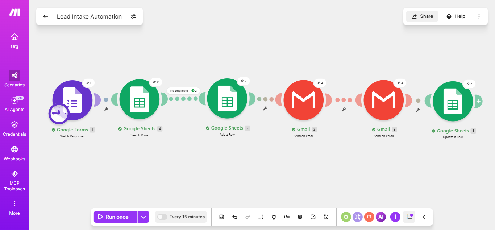

# Lead Intake Automation

## Business Problem

When a business owner is busy with other work, new leads can sit unanswered for hours. Delayed responses can lead to missed opportunities, while manually recording leads and tracking communication adds unnecessary work & delay.

## Solution

This automation ensures that every new lead is handled immediately. When a lead submits the form, the system checks for duplicates, adds the lead to the database, instantly notifies the business owner with the lead details, and sends an acknowledgment email to the lead. The Google Sheet is then automatically updated to record that both messages were sent, so no confusion ever happens.

## Demo

Watch the demo of the lead intake automation: [Demo](https://drive.google.com/file/d/1JYZRnI5hl8Hpa6OJeV_OWoQGU7jvFljr/view?usp=drivesdk)

## Workflow

Google Forms → Google Sheets → Google Sheets → Gmail → Gmail → Google Sheets

## Features

- Instant owner notification

- Automatic lead acknowledgment

- Duplicate lead detection

- Automatic lead record creation

- Communication status tracking

- No manual data entry

## Business Value

- Prevents leads from waiting hours for a response

- Helps the owner respond to new leads immediately

- Keeps leads informed automatically

- Eliminates repetitive manual work

- Maintains an updated record of lead communication

## Tech Stack

- Make.com

- Google Forms

- Google Sheets

- Gmail

## Repository Contents

- README.md

- blueprint.json

- workflow.png

- googlesheet-beforecontact.jpg

- googlesheet-aftercontact.jpg

- owner-gmail.jpg

- customer-gmail.jpg
